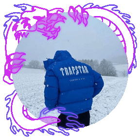

# 🎭 Leahhh - Social Web

<p align="center"> 
   
</p>

<p align="center">
  
  
  
  
</p>

---

## 📝 Project Description

This project implements a modern and interactive personal portfolio with advanced features that create a premium user experience. Developed with HTML5, CSS3, and JavaScript ES6+, the application offers a professional presentation with visual effects, integrated music player, dynamic background videos, and a completely customizable interface.

### ✨ Main Features

- **🎭 Personal Portfolio**: Professional presentation with advanced visual effects
- **🎵 Music Player**: Integrated music system with personal playlist
- **🎬 Background Videos**: Dynamic background videos that change automatically
- **🎨 Visual Effects**: Animated gradients, particles, and glassmorphism effects
- **🌙 Visual Themes**: Light/dark theme system
- **✨ Animations**: Typing effects, snow, and sparkles
- **📱 Responsive Design**: Adaptable to all devices
- **🎛️ Advanced Controls**: Multiple video system and music

---

## 🚀 Implemented Features

### Core Features
- ✅ Personal portfolio with user information
- ✅ Multiple background video system
- ✅ Integrated music player with playlist
- ✅ Animated gradient effects on text
- ✅ Particle and snow system
- ✅ Sparkle effects on the name
- ✅ Typing animations on taglines

### Advanced Features
- **🎬 Video System**: Background videos that change automatically
- **🎵 Music Player**: Advanced controls with personal playlist
- **🎨 Visual Effects**: Glassmorphism, animated gradients, and glow effects
- **🌙 Dynamic Theme**: Switch between light and dark mode
- **✨ Advanced Animations**: Typing effects, snow, and sparkles
- **📱 Responsive Design**: Optimized for all devices
- **🎭 3D Effects**: Tilt effects and parallax on elements

---

## 🔧 Technologies Used

### Frontend
- **HTML5**: Modern and semantic structure
- **CSS3**: 
  - CSS Variables (Custom Properties)
  - Advanced animations and transitions
  - Glassmorphism effects and gradients
  - Responsive design with media queries
  - Visual effects and filters
- **JavaScript ES6+**:
  - Web Audio API for music player
  - Canvas API for visual effects
  - LocalStorage for theme persistence
  - Advanced event handling
  - Modern DOM manipulation

### Development Tools
- **Git and GitHub**: Version control
- **Vanilla Tilt**: 3D effects on elements
- **Google Fonts**: VT323 typography

---

## 🗂️ Project Structure

```
personal-portfolio-website-main/
│
├── 📄 index.html          # Main HTML file
├── 📁 styles.css          # Modern and responsive CSS styles
├── 📁 script.js           # Complete JavaScript logic
├── 📁 assets/             # Multimedia resources
│   ├── 📁 icons/          # Social media icons
│   ├── 📁 music/          # MP3 music files
│   └── 📁 banner.gif      # Animated banner
├── 📄 logo.gif            # User's animated logo
├── 📄 background.mp4      # Main background video
├── 📄 favicon.png         # Site icon
└── 📄 README.md           # Project documentation
```

---

## 🎮 How to Use the Application

### Basic Navigation
1. Click "Click to Enter!" to start
2. Explore the portfolio with personal information
3. Interact with social media links
4. Use the integrated music player

### Advanced Functions
- **🎵 Music**: Control playback from the integrated player
- **🌙 Theme**: Switch between light and dark mode with the top button
- **🎬 Videos**: Background videos change automatically
- **✨ Effects**: Enjoy animations and visual effects

### Special Features
- **Gradient Effects**: Text with animated gradients
- **Particle System**: Animated snow and sparkles
- **3D Effects**: Tilt effects on main elements
- **Typing Animations**: Taglines with typewriter effect

---

## 🎨 Design and UX

### Color Palette
- **Primary**: #a259f7 (Vibrant purple)
- **Secondary**: #8b5cf6 (Medium purple)
- **Accent**: #c084fc (Light purple)
- **Background**: #000000 (Black) / #ffffff (White in light mode)

### Design Features
- **🎯 Glassmorphism**: Glass effects and transparencies
- **🎨 Smooth Animations**: 0.3s transitions on all elements
- **📱 Responsive Design**: Adaptive layout with CSS Grid and Flexbox
- **🎭 Hover Effects**: Advanced visual interactions
- **♿ Accessibility**: Adequate contrast and keyboard navigation

---

## 💻 Code Architecture

### Main Structure
```javascript
// Site configuration
const config = {
  site_name: "Leahhh",
  username: "Leahhh",
  tagline: "fuck love - save money Stuff!!!",
  tagline2: "fuckuuuuuuuu - assssss",
  background_videos: ["background.mp4", "assets/background2.mp4"],
  music_files: ["assets/music/...", "assets/music/..."]
};

// Core Functions
- initBackgroundVideoSystem()    // Multiple video system
- startMusicPlayer()            // Music player
- initTaglineTyping()           // Typing animations
- setTheme()                    // Theme system
- createSocialLinks()           // Social links
```

### Code Features
- **🔧 Modular**: Code organized in specific functions
- **🛡️ Robust**: Complete error handling and states
- **⚡ Efficient**: Optimized for performance
- **📖 Readable**: Detailed comments and descriptive names
- **🔄 Maintainable**: Clear and extensible structure

---

## 🎵 Music Library

The portfolio includes a personal music collection:

1. **SpotiMate.io - GBP (feat. 21 Savage)** - Central Cee
2. **letoa** - Personal artist
3. **SleepMode** - Personal artist
4. **Booter Bee - Phone Call** - Personal artist
5. **deathbed** - Personal artist

---

## 👨‍💻 User Information

| Field        | Value                                |
|---------------|-------------------------------------|
| 🧑 User       | Leahhh |
| 📍 Location   | Netherlands |
| 🎵 Music      | Variety of personal genres |
| 💻 Focus      | Personal and creative portfolio |

### Social Networks
- 🐙 [GitHub](https://github.com/DanielSantiagoV)
- 🎮 [Steam](https://steamcommunity.com/profiles/76561199593430948)
- 💬 [Discord](https://discord.com/users/853723630218117120)
- 🎵 [Spotify](https://open.spotify.com/user/ymu7xcl3jp0p8cfbl8xlnjzr3)
- 🎯 [Try Hack Me](https://tryhackme.com/p/DanielSantiagoV)

---

## 🧪 HIGHLIGHTED CODE

### Modern CSS with Variables
```css
:root {
  --primary-color: #a259f7;
  --secondary-color: #8b5cf6;
  --accent-color: #c084fc;
  --text-color: #ffffff;
  --bg-color: #000000;
  --glass-bg: rgba(255, 255, 255, 0.1);
  --transition: all 0.3s ease;
}

.glass-animated {
  background: linear-gradient(120deg, #fff 10%, #a259f7 30%, #6c2eb7 50%, #3a1c71 70%, #101010 90%, #fff 100%);
  background-size: 600% 600%;
  -webkit-background-clip: text;
  -webkit-text-fill-color: transparent;
  animation: glass-gradient 12s ease-in-out infinite;
}
```

### Advanced JavaScript
```javascript
function initBackgroundVideoSystem() {
  backgroundVideo = document.getElementById("bgVideo");
  
  backgroundVideo.addEventListener('ended', () => {
    currentVideoIndex = (currentVideoIndex + 1) % config.background_videos.length;
    loadNextVideo();
  });
}

function initTaglineTyping() {
  const tagline = config.tagline;
  const tagline2 = config.tagline2;
  
  function tagTick() {
    document.getElementById("tagline").textContent = tagline.slice(0, tagIdx);
    // Typing/erasing animation
  }
}
```

---

## 💬 Conclusion

This project represents a modern and creative personal portfolio that combines attractive visual design with advanced interactive functionalities. The implementation of visual effects, integrated music player, and dynamic video system demonstrates the potential of web technologies to create unique and memorable experiences.

### Technical Achievements
- ✅ **Unique Design**: Personal portfolio with distinctive visual identity
- ✅ **Premium UX**: Professional and visually attractive interface
- ✅ **Advanced Features**: Music, videos, and visual effects
- ✅ **Responsive Design**: Works perfectly on all devices
- ✅ **Creative Features**: Gradient effects, particles, and animations

### Key Learnings
- Implementation of advanced visual effects
- Multiple video system with automatic switching
- Integrated music player
- Animated gradient effects on text
- Particle system and animations
- Light/dark theme management
- Glassmorphism and 3D effects

The project not only presents personal information in an attractive way, but also establishes a standard of creativity and innovation in web portfolio design, creating a memorable experience for visitors.

---

## 🎯 Final Deliverable

Repository: [GitHub – Leahhh Portfolio](https://github.com/DanielSantiagoV/personal-portfolio-website)  
Deployment: [GitHub Pages – Leahhh Portfolio](https://danielsantiagov.github.io/personal-portfolio-website/)

---

## 📞 Contact and Networks

### 🌐 Social Networks
- 🐙 [GitHub](https://github.com/DanielSantiagoV)
- 🎮 [Steam](https://steamcommunity.com/profiles/76561199593430948)
- 💬 [Discord](https://discord.com/users/853723630218117120)
- 🎵 [Spotify](https://open.spotify.com/user/ymu7xcl3jp0p8cfbl8xlnjzr3)
- 🎯 [Try Hack Me](https://tryhackme.com/p/DanielSantiagoV)

---

## 💭 Personal Philosophy

> "Creativity and technology merge to create unique experiences that connect with human emotions and leave a lasting impression." - Leahhh

---

## ✨ Project Highlighted Features

✔️ 🎭 **Personal Portfolio**: Professional and creative presentation  
✔️ 🎵 **Music Player**: Integrated system with personal playlist  
✔️ 🎬 **Dynamic Videos**: Background that changes automatically  
✔️ 🎨 **Visual Effects**: Animated gradients and glassmorphism  
✔️ ✨ **Animations**: Particles, snow, and sparkles  
✔️ 🌙 **Themes**: Light and dark mode  
✔️ 📱 **100% Responsive**: Optimized for all devices  
✔️ 🎛️ **Advanced Controls**: Multiple video system  
✔️ 🎯 **3D Effects**: Tilt effects and parallax  
✔️ 🚀 **Performance**: Optimized code and fluid effects  

---

## 📄 License

This project is licensed under the MIT License - see the [LICENSE](LICENSE) file for details.

---

<p align="center">
  Developed with ❤️ by Leahhh<br>
  🔥 <b><a href="https://github.com/DanielSantiagoV">Visit my GitHub</a></b> 🚀
</p>